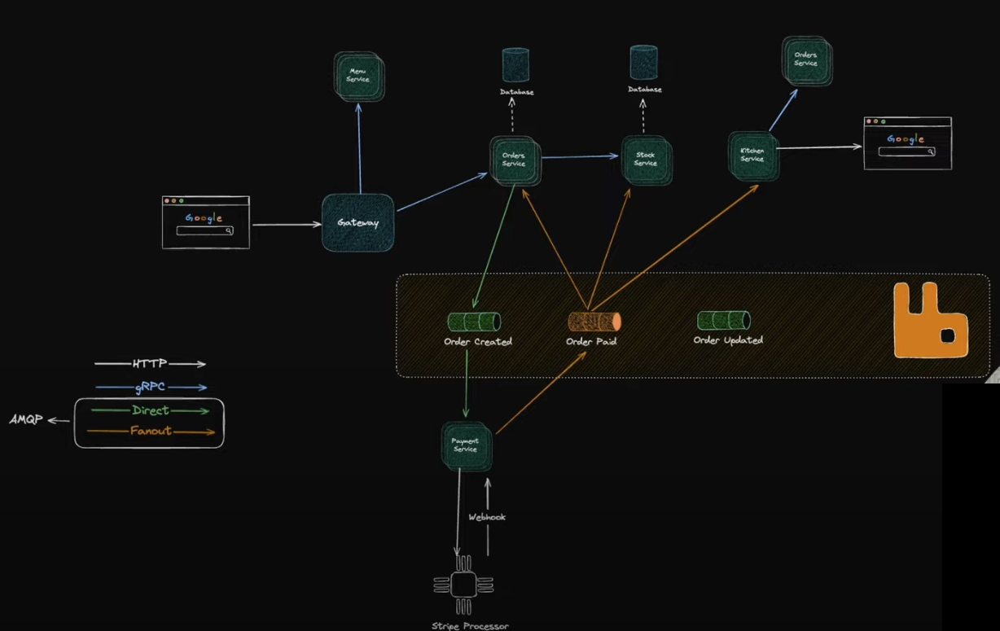

# Order management system 
Order management system created with microservice architecture.

Inspired by: https://www.youtube.com/watch?v=KdnxzgSNLTU

## Prerequisites
- Go
- air
- Make

## How to run

Open up two terminals.
In terminal one: navigate to the orders folder and enter `air`

In the other terminal, go to the gateway folder and enter `air`

This will start the two necessary Microservices

### Generate 
* to regenerate the common/api code, open a terminal, navigate to the common folder and run the `make gen` command.